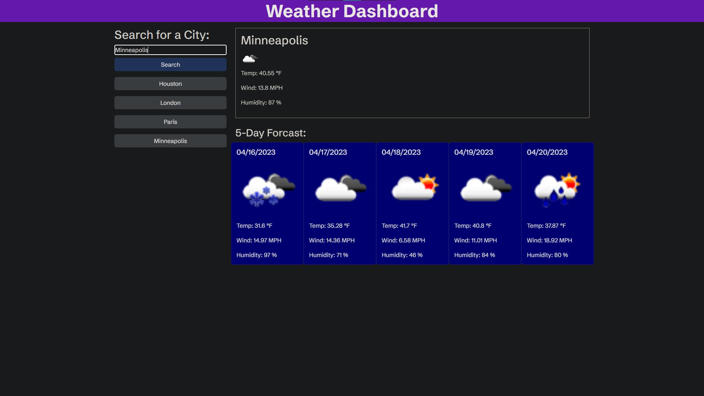

# Weather Search Dashboard

## Description

This weather dashboard searches for a city, which in turn gathers weather information on that city. Information includes temperature, wind speed, humidity, and an icon to indiate the skies - all spanning from the current time to the next 5 days. Previously searched cities also appear as a button below the search bar; pressing a city's respective button automatically gathers its weather data.

This was created using JavaScript APIs fetches (specifically in OpenWeather API), jQuery attributes and appends, and Bootstrap to dynamically generate data.

## Installation

N/A

## Usage

Open the website (<https://anj-23.github.io/weather-dashboard/>) and type in the name of a city in the search bar. Then, press the "Search" button to obtain today's weather and a 5-day weather forcast of the city.

Previous search entries appear as a button below the search bar - akin to a search history. Pressing a button in the search history gathers weather data from the city that it lists.

## Credits

Special thanks to the University of Minnesota - Twin Cities for jumpstarting my coding journey.

## License

MIT License

Copyright (c) [2023] [Andrew Joo]

Permission is hereby granted, free of charge, to any person obtaining a copy
of this software and associated documentation files (the "Software"), to deal
in the Software without restriction, including without limitation the rights
to use, copy, modify, merge, publish, distribute, sublicense, and/or sell
copies of the Software, and to permit persons to whom the Software is
furnished to do so, subject to the following conditions:

The above copyright notice and this permission notice shall be included in all
copies or substantial portions of the Software.

THE SOFTWARE IS PROVIDED "AS IS", WITHOUT WARRANTY OF ANY KIND, EXPRESS OR
IMPLIED, INCLUDING BUT NOT LIMITED TO THE WARRANTIES OF MERCHANTABILITY,
FITNESS FOR A PARTICULAR PURPOSE AND NONINFRINGEMENT. IN NO EVENT SHALL THE
AUTHORS OR COPYRIGHT HOLDERS BE LIABLE FOR ANY CLAIM, DAMAGES OR OTHER
LIABILITY, WHETHER IN AN ACTION OF CONTRACT, TORT OR OTHERWISE, ARISING FROM,
OUT OF OR IN CONNECTION WITH THE SOFTWARE OR THE USE OR OTHER DEALINGS IN THE
SOFTWARE.
